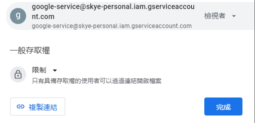

# google-spreadsheet-api
spreadsheet to json with google service account auth

Usage
--
- 私人表單才需要
    - share with `google-service@skye-personal.iam.gserviceaccount.com`
    
- api
    - convert to rows
      - `https://skisle-region.tk/google-spreadsheet-api/googleDoc/spreadsheet?key=[KEY]&gid=[GID]`

    - query string
        - convert to json
            - `alt=json`
        - title_row,start_row
            - `title_row=0` (default 0)
            - `start_row=2` (default 2)
    - example
        ```
        https://skisle-region.tk/google-spreadsheet-api/googleDoc/spreadsheet/private?key=1UsEcOQWeKXW_6dzItRQapKPxfo9ryaHOHEJIb6vYr9A&gid=0&alt=json&title_row=0&start_row=2
        ```

Service Account
--
 - create secret for service account credentisl on GKE

    `kubectl create secret generic google-service-credential --from-file=key.json=credentials.json`

CICD
--
- Google Cloud Build to GKE - [cloudbuild](cloudbuild.yaml)
